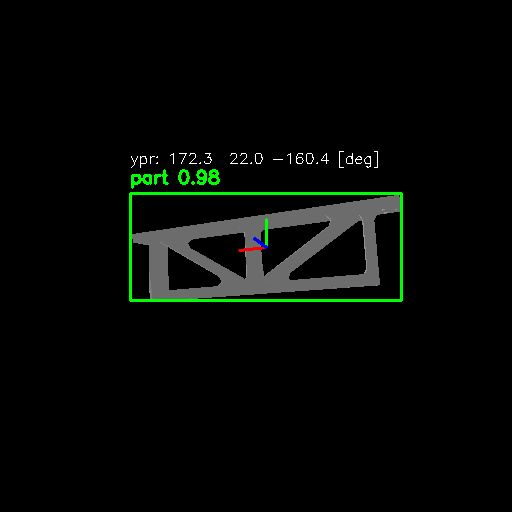

# YOLOv8_3DFusion: Method for Enriching 2D Representations with 3D Point Cloud Data

**This repository contains the implementation of a novel method for enriching 2D representations with geometric data from 3D point clouds to improve scene understanding in industrial applications.**

## 📖 Overview

The project addresses a critical gap in industrial computer vision systems: the lack of methods that effectively integrate visual semantics from 2D images with geometric precision from 3D data. Our approach, **YOLOv8_3DFusion**, enables simultaneous interpretation of technical documentation (2D) and physical object geometry (3D), significantly improving orientation estimation accuracy.

## 🔍 Key Features

- **Two-level fusion architecture**: Combines global context and regional features for accurate orientation estimation
- **SOTA results**: Reduces angular error from 57.9° to 17.5° while maintaining high detection accuracy (mAP@0.5 = 0.89)
- **Industrial applicability**: Designed specifically for manufacturing and CAD analysis scenarios
- **Extensible**: Framework supports integration of GNN-based feature detectors

## 📂 Project Structure
